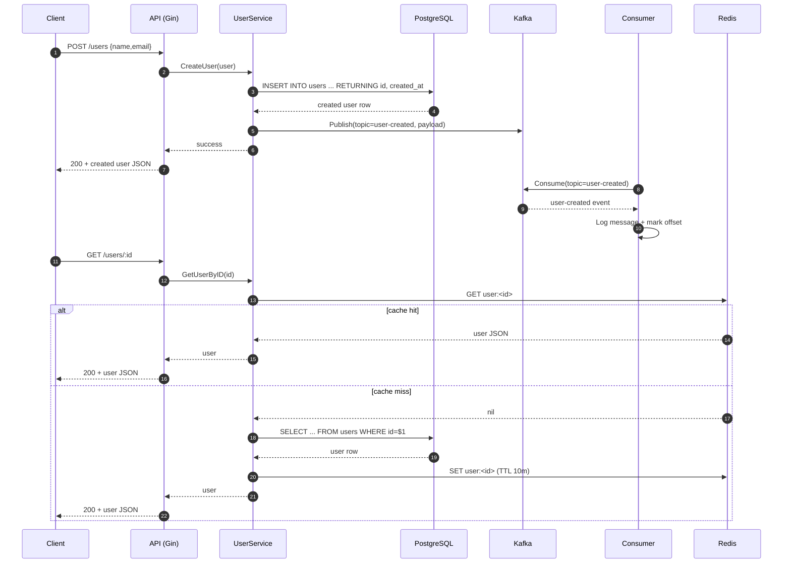

# Realtime Platform

Realtime Platform is a Go backend split into two processes:

- API service (Gin) for user CRUD-style operations
- Kafka consumer service for asynchronous event consumption

The system integrates PostgreSQL (source of truth), Redis (read cache), and Kafka (event stream).

## Current Architecture

1. Client sends HTTP request to API.
2. API validates and persists user data in PostgreSQL.
3. API publishes `user-created` Kafka event.
4. Consumer process reads `user-created` events from Kafka.
5. User reads are served from Redis cache when available, else from PostgreSQL.

## Repository Layout

```text
cmd/
	api/main.go          # HTTP server process
	consumer/main.go     # Kafka consumer process
internal/
	config/              # env loading and logger setup
	db/                  # postgres and redis connectors
	events/              # event payload contracts
	handlers/            # HTTP handlers (Gin)
	kafka/               # producer, consumer, and group handler
	middleware/          # request logging middleware
	models/              # domain models
	repository/          # SQL persistence layer
	services/            # business logic, cache, event publishing
docker-compose.yml     # local infra: postgres, redis, zookeeper, kafka
```

## Tech Stack

- Go 1.26
- Gin for HTTP API
- PostgreSQL via `database/sql` + `lib/pq`
- Redis via `go-redis/v9`
- Kafka via Sarama
- Zap for structured logging
- Docker Compose for local dependencies

## Infrastructure

`docker-compose.yml` starts:

- PostgreSQL 16 (`localhost:5432`)
- Redis 7 (`localhost:6379`)
- Zookeeper (`2181` internal)
- Kafka (`localhost:9092`)

Bring up infra:

```bash
docker compose up -d
```

Check status:

```bash
docker ps
```

## Environment Variables

Create `.env` in project root (or keep existing):

```env
APP_PORT=8080

POSTGRES_HOST=localhost
POSTGRES_PORT=5432
POSTGRES_USER=admin
POSTGRES_PASSWORD=password
POSTGRES_DB=realtime

REDIS_ADDR=localhost:6379
```

Note: `APP_PORT` exists in config but API currently starts with a hardcoded `:8080`.

## Database Setup

The app currently does not run migrations automatically.

Create `users` table manually:

```bash
docker exec -it realtime-postgres psql -U admin -d realtime -c "
CREATE TABLE IF NOT EXISTS users (
	id SERIAL PRIMARY KEY,
	name TEXT NOT NULL,
	email TEXT UNIQUE NOT NULL,
	created_at TIMESTAMP DEFAULT NOW()
);"
```

Verify tables:

```bash
docker exec realtime-postgres psql -U admin -d realtime -c "\dt"
```

## Run Services

Start API service:

```bash
go run cmd/api/main.go
```

Start consumer service (in another terminal):

```bash
go run cmd/consumer/main.go
```

Both processes must run for event production + consumption visibility.

## API Endpoints

### Health Check

```http
GET /health
```

Response:

```json
{"status":"ok"}
```

### Create User

```http
POST /users
Content-Type: application/json
```

Request body:

```json
{
	"name": "Neeraj",
	"email": "neeraj@example.com"
}
```

Notes:

- Body must be JSON (query params are not used by handler).
- Service validates non-empty `name` and `email`.
- On success, API inserts row and publishes Kafka event to topic `user-created`.

### Get User by ID

```http
GET /users/:id
```

Behavior:

- Tries Redis key `user:<id>` first.
- On cache miss, reads from PostgreSQL and caches value for 10 minutes.

## Event Flow

When creating a user:

1. API persists user in PostgreSQL.
2. API publishes `UserCreatedEvent` JSON to Kafka topic `user-created`.
3. Consumer group `notification-group` reads from `user-created`.
4. Consumer prints payload and marks message offset.

## Sequence Diagram



## Logging

- Logger: Zap production logger.
- Output: stdout (terminal), JSON structured logs.
- Middleware logs method, path, status code, and duration.

## Go Modules Knowledge (Important Packages)

This section explains what each major module contributes in this codebase.

### 1) `github.com/gin-gonic/gin`

Role:

- HTTP router + middleware engine.
- Request binding (`ShouldBindJSON`) and response helpers (`c.JSON`).

Why it matters:

- Fast, minimal boilerplate.
- Good layering boundary: handlers remain thin and focused.

How used here:

- Route registration for `/health`, `/users`, `/users/:id`.
- Request logging middleware integration.

### 2) `github.com/IBM/sarama`

Role:

- Native Go client for Kafka producers and consumers.

Why it matters:

- Enables event-driven architecture.
- Supports consumer groups and offset management.

How used here:

- Sync producer sends JSON event messages.
- Consumer group reads topic and marks processed offsets.

### 3) `github.com/redis/go-redis/v9`

Role:

- Redis client for low-latency cache operations.

Why it matters:

- Reduces DB reads for frequent `GET /users/:id` access.

How used here:

- Cache-aside pattern:
	- `GET` from Redis first
	- fallback to Postgres
	- `SET` with TTL (10 min)

### 4) `github.com/lib/pq`

Role:

- PostgreSQL driver for Go `database/sql`.

Why it matters:

- Lets repository layer execute SQL safely with placeholders (`$1`, `$2`).

How used here:

- Connection via DSN in `ConnectPostgres`.
- Insert/select operations in repository.

### 5) `go.uber.org/zap`

Role:

- Structured logger for production-grade logs.

Why it matters:

- Efficient logging with machine-parsable output.
- Useful for observability in distributed systems.

How used here:

- Global logger initialized once at startup.
- Logs DB/Redis connection status and request timeline data.

### 6) `github.com/joho/godotenv`

Role:

- Loads environment variables from `.env` during local development.

Why it matters:

- Keeps configuration externalized and environment-dependent.

How used here:

- App boot reads `.env` and maps into config struct.

## Important Indirect Dependencies You Will See

Even though many dependencies are marked indirect in `go.mod`, they are important because core libraries depend on them.

- `go-playground/validator/v10`: validation plumbing used by Gin binding ecosystem.
- `quic-go/*`, `golang.org/x/*`: transport/runtime support used transitively by HTTP stack.
- `go.uber.org/multierr`, `go.uber.org/atomic`: internals leveraged by Zap.
- `jcmturner/*`: Kafka auth/protocol support used by Sarama.

## Known Gaps in Current Implementation

- No migration runner yet (manual schema setup required).
- No graceful shutdown for API/consumer process resources.
- No persistent Postgres volume defined in compose (data can be lost if container is recreated).
- `APP_PORT` config is loaded but not yet wired into `router.Run`.

## Quick Validation Checklist

1. `docker compose up -d`
2. Create users table in Postgres.
3. Run API process.
4. Run consumer process.
5. `POST /users` with JSON body.
6. Confirm:
	 - API returns created user
	 - consumer terminal prints received message
	 - `GET /users/:id` returns user (second call should be cache hit path)
